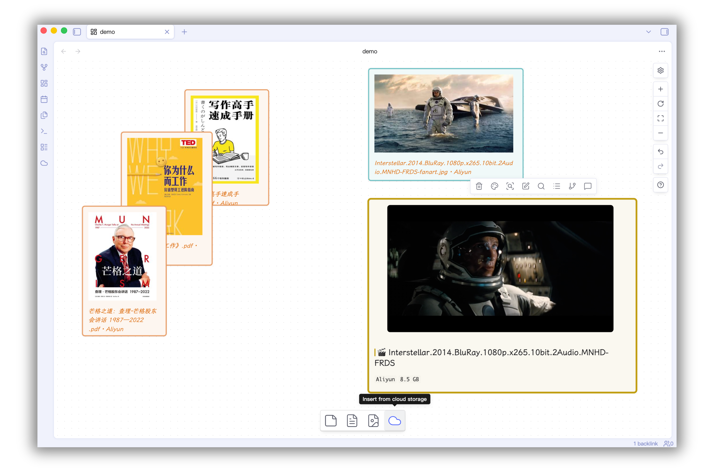

# CloudWeave

**Cloud-storage files woven into Obsidian Canvas.**

[中文](README.zh.md) · [English](README.md)

Browse and insert cloud storage files into Canvas — AI understands both cloud files and local notes together.



---

## Key Features

### ☁️ Cloud File Integration
Browse and insert files from Aliyun, Baidu, Quark, and OneDrive directly into Canvas — without leaving Obsidian.

- **Insert**: Bottom toolbar button or canvas background context menu
- **Track**: Each node records cloud source and path, always traceable
- **Read**: AI can read cloud file content (PDF, text, code, etc.) on demand via `read_cloud_file` tool

### 🤖 AI-Powered Analysis
Select Canvas nodes (local notes + cloud files) and ask AI to analyze them together.

- **Presets**: Summarize, Explain, Find Relations
- **Custom Q&A**: Ask anything about selected nodes
- **Context-aware**: AI understands node layout, connections, and colors
- **Supports**: OpenAI / Gemini / Claude / Ollama

### 🕒 Video/Audio Timestamp
Mark timestamps in notes and jump to corresponding Canvas nodes.

- Shortcut `Cmd+Shift+Space`
- Click to navigate to the Canvas node at the exact second

---

## Prerequisites

- **[Sync Vault](https://github.com/abcamus/sync-vault-ce)** plugin (cloud storage engine)
- Enable **AI → MCP Server** in Sync Vault settings
- Obsidian v1.5+ (Canvas feature)

---

## LLM Configuration

The AI features support multiple providers. Configure in **CloudWeave Settings → LLM Config**.

### OpenAI / Gemini / Claude
| Setting | Value |
|---------|-------|
| Provider | `openai`, `gemini`, or `claude` |
| API Key | Your API key |
| Model | e.g. `gpt-4o-mini`, `gemini-2.0-flash`, `claude-3-haiku` |
| Endpoint | Optional custom endpoint |

### Local (Ollama)
| Setting | Value |
|---------|-------|
| Provider | `local` |
| Endpoint | **Leave empty** (defaults to `http://localhost:11434/api/chat`) |
| Model | The model name you pulled, e.g. `qwen2`, `llama3.2`, `mistral` |
| API Key | Not needed |

Example: After starting Ollama with `ollama run qwen2`, set Provider to `local` and Model to `qwen2`.

---

## Installation

1. Copy `main.js`, `manifest.json`, `styles.css` to `.obsidian/plugins/cloudweave/`
2. Enable **CloudWeave** in Obsidian Settings → Community Plugins
3. Open a Canvas file → Right-click → Insert from cloud storage

---

## Development

```bash
# Install dependencies
pnpm install

# Dev build (watch)
pnpm run dev

# Production build
pnpm run build

# Deploy to vault
pnpm run deploy
```

---

## Roadmap

- **[P0] Cloud file insertion + AI Q&A** ✅
- **[P1] Audio transcription** — Transcribe cloud audio/video via AI
- **[P2] Web search** — AI can search the web as context
- **[P3] Advanced AI workflow** — Custom prompts, multi-turn, tool composition

---

## Architecture

```
Obsidian
├── CloudWeave Plugin
│   ├── Cloud node (cloud-link + JSON meta)
│   ├── Timestamp system
│   └── AI Q&A panel
└── Sync Vault Plugin
    └── MCP Server (Aliyun / Baidu / Quark / OneDrive)
```

---

## License

GPL-3.0
